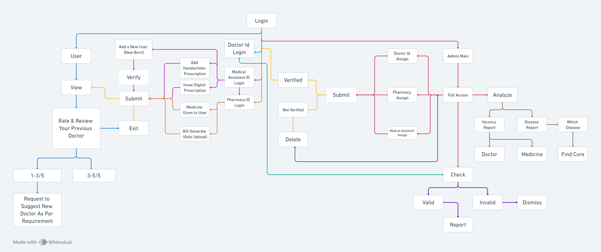

<!-- 

    
    
    
    
    

 -->

 

    <em>This project aims to efficiently manage and monitor patient health records, fostering improved doctor-patient and pharmacist-patient relationships. It serves the dual purpose of enhancing communication and thwarting fraudulent practices by verifying the credentials of healthcare professionals, thus ensuring a safer and more transparent healthcare ecosystem.</em>

    <em>Looking for our hosted site <a href="https://medicinewallet.000webhostapp.com/">Try This →</a></em>

---

# **Introduction**

### <u>**Purpose**</u>

This document details the specifications for Medi Sync Wallet, aiming to provide a comprehensive health card to patients. It involves roles such as Admin, User, Doctor, Medical Assistant, and Pharmacist, covering user registration, doctor-patient interactions, prescription management, and pharmacy transactions.

### <u>**Scope**</u>

Medi Sync Wallet streamlines healthcare processes by digitizing and maintaining patient records, enabling communication among healthcare professionals. It includes features like medicine subscription, emergency services, and smartwatch support.

### <u>**Definitions**</u>

* Admin: System administrator with the highest access.
* User: Individuals with a health card, able to view their medical history.
* Doctor: Healthcare professionals managing patient checkups and complaints.
* Medical Assistant: Handles prescriptions, issues digital prescriptions, and adds new users.
* Pharmacist: Dispenses medicines, generates bills, and manages transactions.
#
# **Workflow**
> It is a basic workflow diagram made for our project...

<!--  -->

#
# 💭**Inspiration**
Certainly, here are the key points outlining the inspiration behind Medicine Wallet :

* Identifying a Crucial Need:
    * Recognizing a pressing need within the healthcare sector for a consolidated platform facilitating efficient communication and record-keeping among patients and healthcare professionals.

* Simplifying Healthcare Processes:
    * Medicine Wallet emerges from the goal to simplify healthcare procedures, offering an accessible system for users to manage medical records, prescriptions, and transactions seamlessly.

* User-Centric Approach:
    * Conceived with a user-centric vision, Medicine Wallet strives to provide a hassle-free experience for patients while empowering healthcare professionals in their daily workflows.

* Addressing Healthcare Challenges:
    * Acknowledging the challenges inherent in healthcare management, Medicine Wallet is designed to address them, promoting efficiency, accessibility, and streamlined interactions.

* Enhancing Convenience:
    * By bridging the gap between patients and healthcare providers, Medicine Wallet seeks to enhance overall convenience, fostering a harmonious relationship in the healthcare journey.

* Tailored Healthcare Expertise:
    * Medicine Wallet facilitates the discovery of specialized healthcare professionals, ensuring users connect with experts suited to their unique medical needs.

* Empowering Healthcare Professionals:
    * In the spirit of empowerment, Medicine Wallet offers healthcare professionals a platform to expand their reach, showcase their expertise, and connect with a broader audience, ultimately contributing to an enriched healthcare ecosystem.

#
# 💡**What problem does the project solve?**

* Limited Access to Comprehensive Healthcare:

    * Problem: Difficulty in accessing comprehensive healthcare services, leading to fragmented medical records and communication.
    * Solution: Medicine Wallet ensures centralized access to patient records, streamlining interactions between healthcare professionals and individuals.

* Lack of Transparency in Healthcare Services:

    * Problem: Uncertainty and lack of transparency in healthcare procedures, causing trust issues between patients and healthcare providers.
    * Solution: Medicine Wallet promotes transparency by offering detailed information about healthcare professionals, fostering trust in the healthcare process.

* Challenges in Finding Specialized Healthcare Expertise:

    * Problem: Difficulty in locating healthcare professionals with specific expertise tailored to individual medical needs.
    * Solution: Medicine Wallet simplifies the process, enabling users to find specialized professionals relevant to their unique medical situations.

* Inefficient Patient-Doctor Interactions:

    * Problem: Time-consuming and inefficient methods of managing patient interactions and medical prescriptions.
    * Solution: Medicine Wallet streamlines these processes, enhancing efficiency and saving time for both healthcare professionals and patients.

* Limited Exposure for Healthcare Professionals:

    * Problem: Healthcare professionals face challenges in expanding their client base and gaining exposure.
    * Solution: Medicine Wallet empowers healthcare professionals by providing a platform for registration and visibility, connecting them with a broader audience in the healthcare ecosystem.

#
# 💻 **Built With**

          
          

#
# **Hall of Fame** ✨

We love our contributors! If you'd like to contribute anything from a bug-fix to a feature update, you can read our [CONTRIBUTING GUIDE](https://github.com/0LEUM/Medicine-Wallet/blob/main/CONTRIBUTING.md)

 

&mdash; 🩺  &mdash;

<i>Medicine Wallet is <a href="https://github.com/0LEUM/Medicine-Wallet/blob/main/LICENSE">MIT License</a> code</i>

